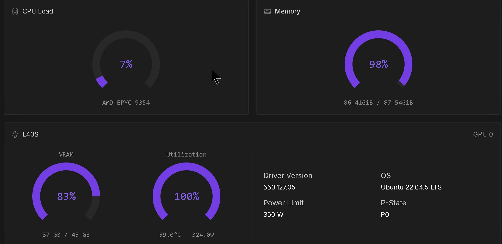
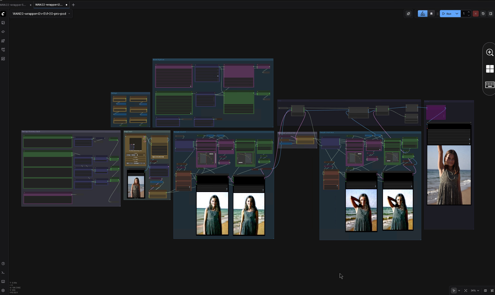

[](https://hub.docker.com/r/ls250824/run-comfyui-wan2)

# 🚀 Run WAN 2.x with ComfyUI with provisioning — RunPod





A streamlined and automated environment for running **ComfyUI** with **WAN 2.x video models**, optimized for use on RunPod

## 🔧 Features

- Automatic model and LoRA downloads via environment variables.
- Built-in **authentication** for:
  - ComfyUI
  - Code Server
  - Hugging Face API
  - CivitAI API
- Supports advanced workflows for **video generation** and **enhancement** using pre-installed custom nodes.
- Compatible with high-performance NVIDIA GPUs.

## 🧩 Template Deployment

### Deployment.

- All available templates on runpod are tested on a L40S/A40.

### Runpod templates

[**👉 One-click Deploy on RunPod WAN 2.2 t2v (lightx2v)**](https://console.runpod.io/deploy?template=qvozvvb1xd&ref=se4tkc5o)

[**👉 One-click Deploy on RunPod WAN 2.2 i2v + SVI 2.0 PRO (lightx2v)**](https://console.runpod.io/deploy?template=moem21s8xb&ref=se4tkc5o)

[**👉 One-click Deploy on RunPod WAN 2.2 animate (lightx2v)**](https://console.runpod.io/deploy?template=tp7gj0khyo&ref=se4tkc5o)

[**👉 One-click Deploy on Runpod WAN SCAIL VI2V (lightx2v)**](https://console.runpod.io/deploy?template=9i0lkwau54&ref=se4tkc5o)

### Documentation

- [⚙️ Start](https://comfyui.rozenlaan.site/ComfyUI_WAN)
- [📚 Tutorial](https://comfyui.rozenlaan.site/ComfyUI_WAN_tutorial)
- [⚙️ Provisioning examples](docs/ComfyUI_WAN_provisioning.md)

## 🐳 Docker Images

### Base Images

- **PyTorch Runtime**  [](https://hub.docker.com/r/ls250824/pytorch-cuda-ubuntu-runtime)

- **ComfyUI Runtime**  [](https://hub.docker.com/r/ls250824/comfyui-runtime)

### Custom Image

docker pull ls250824/run-comfyui-wan2:<[](https://hub.docker.com/r/ls250824/run-comfyui-wan2)>

## 🛠️ Build & Push Docker Image (Optional)

Use none docker setup to build the image using the included Python script.

### Build Script: `build-docker.py`

| Argument       | Description                        | Default          |
|----------------|------------------------------------|------------------|
| `--username`   | Your Docker Hub username           | Current user     |
| `--tag`        | Custom image tag                   | Today's date     |
| `--latest`     | Also tag image as `latest`         | Disabled         |

### Example Usage

```bash
git clone https://github.com/jalberty2018/run-comfyui-wan2.git
cp ./run-comfyui-wan2/build-docker.py ..

export DOCKER_BUILDKIT=1
export COMPOSE_DOCKER_CLI_BUILD=1

python3 build-docker.py   --username=<your_dockerhub_username>   --tag=<custom_tag>   --latest   run-comfyui-wan2
```